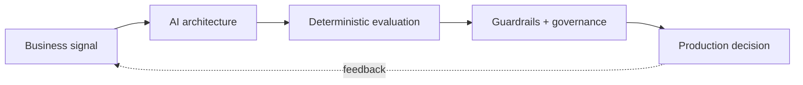

<!--
  GitHub Profile README for github.com/alirezarashidipp
  Palette: midnight / cyan / violet
-->
<!-- markdownlint-disable MD013 MD033 MD041 MD060 -->

  

 

  
  
  
  

  

<h3 align="center"><em>AI should not merely work. It should be measurable, explainable, governable, and scalable.</em></h3>

  Senior Data Scientist · GenAI / AI Architect · MLOps · Author 
  Based in Poland · Building at the intersection of intelligence, evidence, and business value

---

## 01 — What I build

I turn ambiguous business problems into production AI systems with explicit outcome metrics, evaluation contracts, and operational guardrails. With 10+ years in data and analytics, my work has evolved from predictive models and BI into GenAI, agentic systems, and AI model risk.

<table>
  <tr>
    <td width="50%" valign="top">
      <h3>◈ Generative &amp; Agentic AI</h3>
      
RAG · structured generation · tool-using agents · orchestration · prompt systems · human-in-the-loop workflows

    </td>
    <td width="50%" valign="top">
      <h3>◎ Evaluation &amp; Model Risk</h3>
      
Groundedness · hallucination analysis · LLM-as-a-Judge · validation · guardrails · governance · reliability metrics

    </td>
  </tr>
  <tr>
    <td width="50%" valign="top">
      <h3>⌁ Applied Machine Learning</h3>
      
Classification · ranking · forecasting · NLP · feature engineering · explainability · active learning

    </td>
    <td width="50%" valign="top">
      <h3>△ Production Engineering</h3>
      
AI APIs · containers · CI/CD · data pipelines · observability · cloud workflows · feedback loops

    </td>
  </tr>
</table>

> [!IMPORTANT]
> **My design law:** keep deterministic computation at the core of evidence, and use probabilistic reasoning where judgment actually adds value.

## 02 — The system blueprint

<code>frame the decision → design for reliability → evaluate everything → operationalize trust</code>

## 03 — Selected work

<table>
  <tr>
    <td width="50%" valign="top">
      <h3>🛡️ Agentic Model Risk Validator</h3>
      
An end-to-end validation app that behaves like a lightweight model-risk team. Deterministic Python computes the evidence; structured agents turn it into findings, challenge questions, risk ratings, and validation decisions.

      
<code>Python</code> <code>FastAPI</code> <code>Responses API</code> <code>SHAP</code> <code>Streamlit</code> <code>Docker</code>

      <a href="https://github.com/alirezarashidipp/agentic-model-risk-validator"><strong>Explore the system →</strong></a>
    </td>
    <td width="50%" valign="top">
      <h3>🧍 Real-time Posture Intelligence</h3>
      
A maintainable computer-vision package for live posture detection, with landmark geometry, configurable classification, CLI tools, unit tests, and continuous integration.

      
<code>Python</code> <code>MediaPipe</code> <code>OpenCV</code> <code>Pytest</code> <code>GitHub Actions</code>

      <a href="https://github.com/alirezarashidipp/hunchback-detection"><strong>View the project →</strong></a>
    </td>
  </tr>
  <tr>
    <td width="50%" valign="top">
      <h3>⚡ Energy Forecasting Lab</h3>
      
A European energy-consumption forecasting workflow comparing statistical, additive, and deep-learning approaches across reproducible time-series experiments.

      
<code>ARIMA</code> <code>Prophet</code> <code>LSTM</code> <code>Pandas</code> <code>Time Series</code>

      <a href="https://github.com/alirezarashidipp/energy-forecasting-timeseries"><strong>Inspect the forecasts →</strong></a>
    </td>
    <td width="50%" valign="top">
      <h3>🔎 Intelligent Value Extraction</h3>
      
An applied NLP architecture that transforms free text into traceable business-value signals—preserving evidence, scores, ontology mappings, and the decision path for review.

      
<code>NLP</code> <code>Embeddings</code> <code>Ontology</code> <code>Calibration</code> <code>Human Review</code>

      <a href="https://alirezarashidi.ir/2026/02/07/intelligent-value-extraction/"><strong>Read the architecture →</strong></a>
    </td>
  </tr>
</table>

<a href="https://github.com/alirezarashidipp?tab=repositories"><strong>Browse all repositories ↗</strong></a>

## 04 — My working stack

| Intelligence | ML & explainability | Engineering | Data & decisions |
|:--|:--|:--|:--|
| LLMs, RAG, agents, structured outputs, prompt systems | scikit-learn, XGBoost, SHAP, spaCy, forecasting | Python, FastAPI, Pydantic, Docker, REST, CI/CD | SQL, BigQuery, ETL, warehousing, Power BI, Tableau, Qlik |

  
  
  
  
  
  
  
  
  
  
  
  

## 05 — Research frontier

My long-horizon research project, **DEEP PHYSICS**, explores how AI and metadata can help quantify patterns of human behavior and decision-making—without hiding uncertainty behind a model score.

- **Trust layers for agentic AI** — evaluation, observability, risk controls, and graceful failure.
- **Traceable decision systems** — turning unstructured language into evidence-backed, reviewable signals.
- **Human + machine judgment** — defining where autonomy helps and where review must remain explicit.

## 06 — Writing & books

| Read | Why it matters |
|:--|:--|
| [**The LLM Evaluation Framework**](https://alirezarashidi.ir/2026/02/06/llm-evaluation/) | A layered approach to measuring quality, safety, system behavior, and business outcomes. |
| [**Intelligent Value Extraction**](https://alirezarashidi.ir/2026/02/07/intelligent-value-extraction/) | From free text to consistent, traceable portfolio signals. |
| [**AI Framework Wars**](https://alirezarashidi.ir/2026/02/07/langgraph-vs-langchain-and-more/) | When to use LangChain, LangGraph, Instructor, or DSPy—and when not to. |
| [**Three published books**](https://alirezarashidi.ir/books/) | Explorations across data, management, physics, and self-awareness. |

## 07 — GitHub signal

  
  

---

<h2 align="center">Let’s build AI that earns trust.</h2>

  If your challenge lives between <strong>prototype and production</strong>—especially GenAI, RAG, agents, evaluation, or model risk—I’d be glad to connect.

  
  

 

  Designing intelligence with evidence, control, and purpose.

