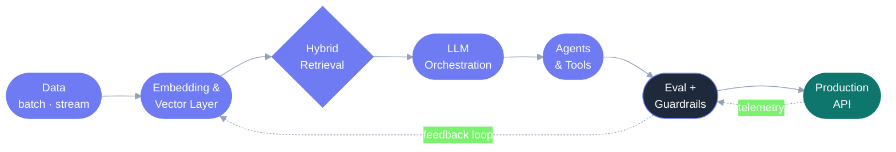

<div align="center">


<br>

[](http://www.alirezarashidi.com)
[](https://www.linkedin.com/in/ali-reza-rashidi/)
[](mailto:YOUR-EMAIL@example.com)


</div>

<br>


### ⚡ Currently

```yaml
role:    Sr. Data Scientist — Generative AI
focus:   [ RAG at scale, agentic workflows, LLM evaluation ]
solving: the research → production gap
metrics: [ latency, cost, reliability, observability ]
writing: alirezarashidi.com
```

<br clear="right">

---

### 🧠 How I build AI systems



---

### 🧰 Stack

**Gen AI & LLM**


**Core**

[](https://skillicons.dev)

**Platform**

[](https://skillicons.dev)

**Cloud**

[](https://skillicons.dev)

---

### 📊 Signals

<div align="center">


</div>

<div align="center">


</div>
